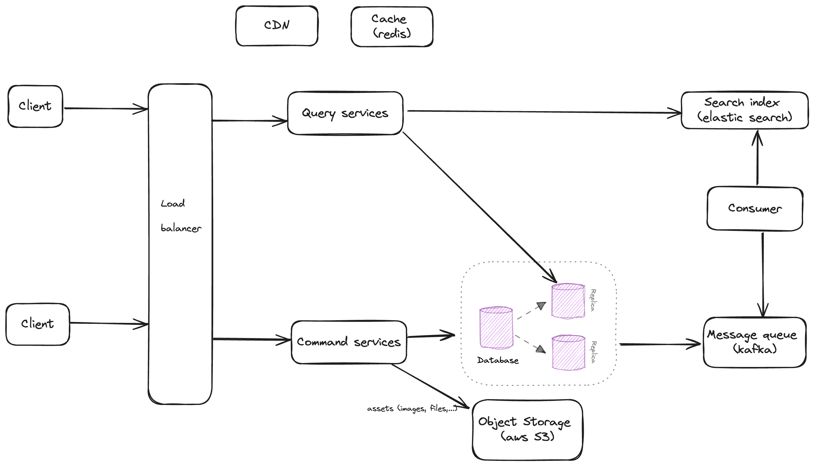

# Assessment

## Section 1
### Idea is to separate query and command.

For **command-services**: persist to database (this case use postgreSQL). For assets (images, files,..) will store them to distributed object store (aws S3 for example). To sync data for read services, can be use replication, and also push event sync data to message queue (use kafka). By use message queue (eg: kafka) will be able to apply SAGA pattern for distributed transaction (for flow: booking, payment,... ). 

For **query-services**: use search index engine (used elastic search), and also connect replica database. Idea is to use CDN and cache to improve time response.

### What i have implemented:
- Command service: service that persist to postgresql (have not setup for replication yet), integrated kafka to push message purpose is to index data to elastic search (when create hotel, create booking,...). Integrated with flyway: auto migrate database schemas. Defined a test suite for create booking, cancel booking. 
- Query service: integrated elastic search, kafka to consume message for purpose index data. Defined test suite for query hotel, booking.
- Dockerized application

### To start application
`docker-compose up -d`

